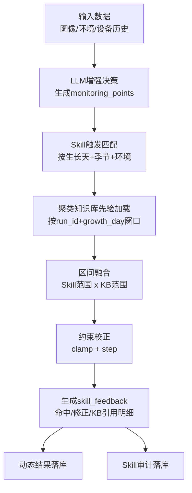

# Skill+知识库融合决策算法说明

- **文档版本**: v1.0
- **最后更新**: 2026-02-28
- **适用范围**: 鹿茸菇库房环境调控（温度/湿度/CO2 与设备设定点）
- **目标读者**: 客户方管理者、运维负责人、技术评审

---

## 1. 背景与痛点

在真实生产中，单纯依赖大模型输出会遇到三类问题：

1. **输出不稳定**：JSON 解析失败、上下文超长、fallback 触发导致建议波动。  
2. **经验难复用**：现场班组的有效调控经验无法结构化沉淀。  
3. **建议可解释性不足**：客户难以判断建议是否“符合历史最佳实践”。

为解决以上问题，我们引入了 **Skill+知识库融合决策算法**：

- 用 `Skill` 表达可复用的现场/行业调控能力（触发条件 + 动作 + 安全边界）。
- 用 `聚类知识库` 提供历史统计先验（按生长天与点位给出稳定区间）。
- 在大模型输出后执行“二次约束校正”，保证建议更稳、更可解释、可追溯。

---

## 2. 算法总体架构

---

## 3. 核心流程（可直接对客户讲）

### 第一步：LLM 生成初始建议

系统先基于多源数据（图像、环境、设备变更）生成 `monitoring_points` 建议值，作为“初稿”。

### 第二步：Skill 触发

系统根据当前上下文触发 Skill：

- 生长天（`growth_day`）
- 季节（`season`）
- 温湿度/CO2 区间

命中的 Skill 会提供目标点位与建议范围，例如：

- 加湿器开停区间
- 新风 CO2 启停阈值
- 冷风机温度设定区间

### 第三步：知识库先验注入

系统从最新有效 `cluster` 知识库读取同点位先验：

- 历史中位值（`value_median`）
- 历史稳定区间（`value_p25 ~ value_p75`）
- 样本量（`sample_days`）
- 生长窗口（`growth_window`）

### 第四步：Skill 与 KB 区间融合

对每个点位计算最终约束区间：

- 若知识库样本充足（`sample_days >= 8`）且与 Skill 有交集：优先取交集，增强稳态。  
- 若样本不足或无交集：采用“中点折中 + 半宽约束”，避免一次性过激调节。

### 第五步：约束校正与步长离散

对 LLM 初始值执行：

1. `clamp` 到融合后的区间；
2. 按 `step` 做离散化（如 0.5℃、50ppm）；
3. 计算是否超过阈值并标记 `change`。

### 第六步：可解释反馈与审计

输出 `skill_feedback`：

- 命中 skill 数与 skill_id 列表
- 修正次数与修正明细
- KB 先验点位数与引用次数
- 触发上下文快照

并写入审计表，实现可追踪可复盘。

---

## 4. 关键原理（简化版）

### 4.1 区间融合原理

设：

- Skill 区间为 $[L_s, U_s]$
- 知识库区间为 $[L_k, U_k]$

**场景A（样本充足且可交）**：
$$
L = \max(L_s, L_k),\quad U = \min(U_s, U_k)
$$
优点：更贴近历史稳定区间，减少震荡。

**场景B（无交集或样本不足）**：
- 取 Skill 与 KB 中心做折中；
- 保留较保守半宽，防止突变。

### 4.2 约束校正原理

对初始建议值 $x$：

1. 区间裁剪：$x' = \min(\max(x, L), U)$  
2. 步长离散：按步长 $s$ 映射到最近可执行值

结果是“可执行、可解释、可回放”的最终设定值。

---

## 5. 效果说明（当前版本实测）

基于最近一次批任务（4 个库房）实测：

- 批任务成功率：**4/4**
- Skill 命中库房：**1/4（25%）**
- Skill 总修正次数：**2**
- KB 先验引用次数：**1**
- 典型案例：库房 608 出现 `matched=1, corrections=2, kb_used=1`

> 说明：命中率受当前时段、生长天、环境区间和技能库覆盖度影响。随着技能库和知识库持续迭代，命中率与修正质量会逐步提升。

---

## 6. 给客户的核心价值

1. **稳定性**：即使 LLM 波动，最终输出仍受规则+知识库约束。  
2. **经验资产化**：现场经验结构化后可跨班组、跨库房复用。  
3. **可解释可追溯**：每次修正都能回答“为什么改、依据是什么”。  
4. **可持续优化**：可通过审计数据持续评估“命中率/修正率/效果”。

---

## 7. 落地边界与后续建议

### 当前边界

- 仍会受上游数据完整性影响（如 embedding 缺失）。
- 技能库覆盖不足时，命中率会偏低。

### 后续建议

1. 扩充 `cultivation_skill_library.json` 覆盖更多阶段与季节。  
2. 将审计指标接入看板，持续展示命中率、KB 引用率、修正有效率。  
3. 引入 A/B 对照（启用/停用 KB 先验），量化产线收益。

---

## 8. 对应实现位置（便于技术对齐）

- Skill 引擎：`src/decision_analysis/skills/cultivation_skill.py`
- 决策执行接入：`src/scripts/analysis/run_enhanced_decision_analysis.py`
- 批任务汇总与日志：`src/decision_analysis/tasks.py`
- 审计落库：`src/utils/create_table.py`
- Skill 配置库：`src/configs/cultivation_skill_library.json`
